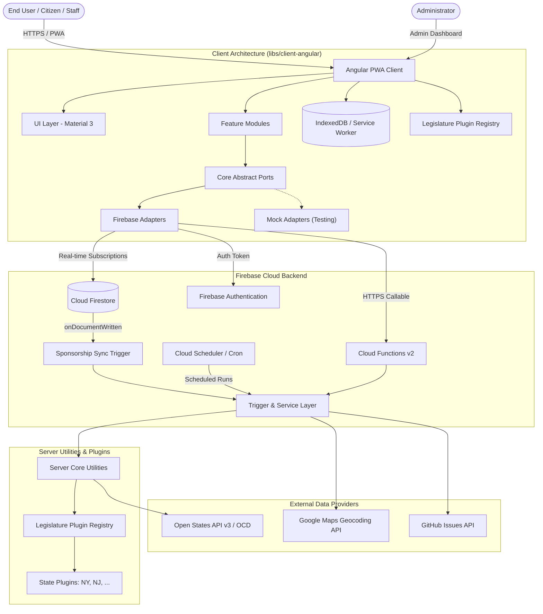
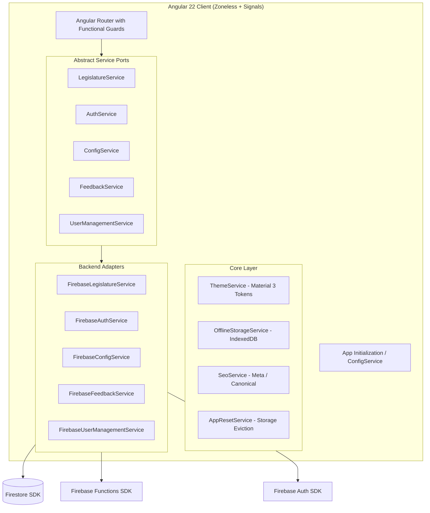
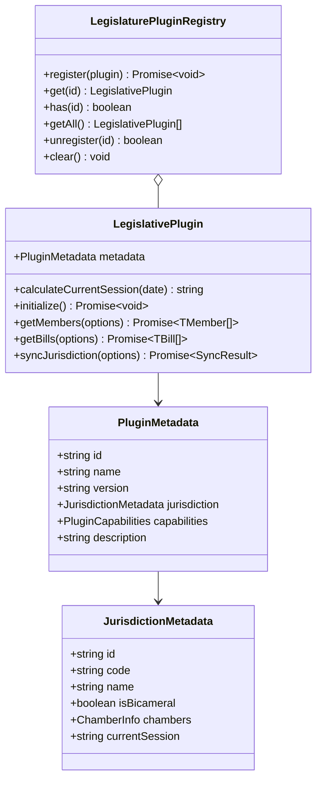
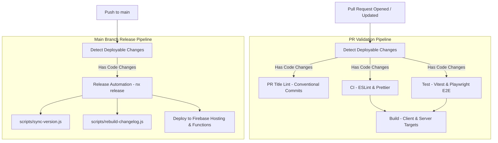

# Legislative Tracker Architecture

## 1. Overview & Core Philosophy

**Legislative Tracker** is an open-source, multi-state civic tech platform designed to track state legislation, monitor lawmaker voting records, map citizen districts to representatives, and provide accessible legislative intelligence.

The system is structured as an **Nx Monorepo** combining a modern **Angular Progressive Web Application (PWA)** on the frontend and a serverless **Firebase Cloud Functions (v2) & Firestore** architecture on the backend.



### Core Design Principles

1. **Modular Monorepo (Nx)**: Strict separation of concerns between client features, backend triggers, reusable UI components, data-access layers, domain models, and state plugins.
2. **Ports-and-Adapters (Hexagonal Architecture)**: The Angular client relies entirely on abstract service contracts (`LegislatureService`, `AuthService`, `ConfigService`, `FeedbackService`, `UserManagementService`), allowing pluggable backend adapters (Firebase vs. Mock implementations).
3. **Extensible State Plugin Engine**: Jurisdiction-specific legislative calendars, session biennium calculations, chamber models, and data-fetch logic are encapsulated in modular plugins (`@legislative-tracker/plugins-*`).
4. **Offline-First PWA**: Built-in Progressive Web App support utilizing `@angular/service-worker` and `IndexedDB` (`idb`) for offline bill caching, local notes, and optimistic network reconnection sync.
5. **Event-Driven & Scheduled Serverless Operations**: Automated daily bill synchronization, monthly lawmaker directory refreshes, and automatic Firestore document triggers to maintain bidirectional index integrity.

## 2. Repository Layout & Monorepo Boundaries

The codebase is organized into applications and domain libraries within Nx:

```
legislative-tracker/
├── apps/
│   ├── client-angular/          # Standalone Angular PWA application
│   └── server-firebase/         # Firebase Cloud Functions v2 entrypoint
├── libs/
│   ├── client-angular/
│   │   ├── core/                # Ports, adapters, guards, auth/theme/offline services
│   │   ├── features/            # Feature pages (legislative, admin, user, auth, static)
│   │   └── ui/                  # Reusable presentation components, dialogs, layouts
│   ├── plugins/
│   │   ├── core/                # Plugin interfaces, contracts, and PluginRegistry
│   │   ├── leg-us-nj/           # New Jersey legislative plugin implementation
│   │   └── leg-us-ny/           # New York legislative plugin implementation
│   ├── server/
│   │   ├── data-access/
│   │   │   ├── github/          # GitHub API integration for issue/feedback submission
│   │   │   ├── google-maps/     # Geocoding service for user address resolution
│   │   │   └── openstates/      # Open States GraphQL/REST client for OCD data
│   │   ├── triggers-firebase/   # Cloud Functions triggers (callable, scheduled, firestore)
│   │   └── util-core/           # Business logic orchestrators and plugin resolvers
│   └── shared/
│       └── models/              # Shared TypeScript interfaces and domain models
├── docs/                        # Project documentation and changelog
├── firestore.rules              # Security rules for Cloud Firestore
├── firebase.json                # Firebase hosting, functions, and emulator definitions
└── nx.json                      # Nx workspace and release configuration
```

### Path Aliases & Module Mappings

All library dependencies are referenced via TypeScript base path aliases:

| Path Alias                                            | Physical Directory                                 | Purpose                                          |
| :---------------------------------------------------- | :------------------------------------------------- | :----------------------------------------------- |
| `@legislative-tracker/client-angular/core`            | `libs/client-angular/core/src/index.ts`            | Client core abstractions, adapters, and services |
| `@legislative-tracker/client-angular/features`        | `libs/client-angular/features/src/index.ts`        | Routed feature modules and views                 |
| `@legislative-tracker/client-angular/ui`              | `libs/client-angular/ui/src/index.ts`              | Reusable presentation components                 |
| `@legislative-tracker/plugins-core`                   | `libs/plugins/core/src/index.ts`                   | Plugin definitions and registration service      |
| `@legislative-tracker/plugins-leg-us-ny`              | `libs/plugins/leg-us-ny/src/index.ts`              | New York state plugin                            |
| `@legislative-tracker/plugins-leg-us-nj`              | `libs/plugins/leg-us-nj/src/index.ts`              | New Jersey state plugin                          |
| `@legislative-tracker/server-data-access-openstates`  | `libs/server/data-access/openstates/src/index.ts`  | Open States API client                           |
| `@legislative-tracker/server-data-access-google-maps` | `libs/server/data-access/google-maps/src/index.ts` | Google Maps Geocoding client                     |
| `@legislative-tracker/server-data-access-github`      | `libs/server/data-access/github/src/index.ts`      | GitHub Issue creation client                     |
| `@legislative-tracker/server-triggers-firebase`       | `libs/server/triggers-firebase/src/index.ts`       | Cloud Functions backend triggers                 |
| `@legislative-tracker/server-util-core`               | `libs/server/util-core/src/index.ts`               | Backend business logic orchestrator              |
| `@legislative-tracker/shared/models`                  | `libs/shared/models/src/index.ts`                  | Cross-boundary domain models and DTOs            |

## 3. Frontend Architecture (`apps/client-angular`)



### 3.1 Angular 22 & Modern Patterns

- **Zoneless Change Detection**: Configured via `provideZonelessChangeDetection()`, eliminating `zone.js` runtime overhead and relying on Angular Signals (`signal`, `computed`, `effect`) for fine-grained reactivity.
- **Standalone Component Structure**: All components, directives, and pipes are standalone, minimizing boilerplate and optimizing tree-shaking.
- **Functional Route Guards**:
  - `stateGuard`: Validates the `:stateCd` parameter against the `LegislaturePluginRegistry`. If invalid, redirects to the 404 handler.
  - `adminGuard`: Enforces admin authentication claims via custom claims (`token.admin`) and user role fields.
  - `authGuard`: Protects profile and user management routes for authenticated users.
- **Component Input Binding**: Routed parameters (`:stateCd`, `:billId`, `:memberId`) bind directly to component signal inputs via `withComponentInputBinding()`.

### 3.2 Ports and Adapters (Hexagonal Pattern)

The frontend abstracts all backend interactions behind abstract classes:

| Port Interface          | Description                                                          | Implementations                                              |
| :---------------------- | :------------------------------------------------------------------- | :----------------------------------------------------------- |
| `LegislatureService`    | Fetches legislation, bills, lawmakers, and executes curation actions | `FirebaseLegislatureService`, `MockLegislatureService`       |
| `AuthService`           | Handles user authentication, session state, login/logout             | `FirebaseAuthService`, `MockAuthService`                     |
| `ConfigService`         | Loads runtime branding, theme config, and organization metadata      | `FirebaseConfigService`, `MockConfigService`                 |
| `FeedbackService`       | Submits feedback and bug reports to GitHub                           | `FirebaseFeedbackService`, `MockFeedbackService`             |
| `UserManagementService` | Admin functionality for assigning roles                              | `FirebaseUserManagementService`, `MockUserManagementService` |

### 3.3 Dynamic Material Design 3 Theming

`ThemeService` generates real-time Material Design 3 color palettes using `@material/material-color-utilities`:

- Supports `light`, `dark`, and automatic `system` color scheme tracking.
- Derives dynamic tonal palettes (Primary, Secondary, Tertiary, Neutral, Neutral Variant, Error) and flattens them into `--mat-sys-*` and `--mat-sys-color-*` CSS Custom Properties.
- Allows custom organization branding overrides defined in `RuntimeConfig`.

### 3.4 Offline-First Engine

`OfflineStorageService` provides seamless offline access:

- Uses `idb` to manage an IndexedDB database (`legislative_tracker_db`) with object stores for `saved_bills` and `offline_notes`.
- Listens to `window.online` and `window.offline` network events, updating an `isOnline` reactive signal.
- Caches bill models locally so users can read saved bills and take private notes while offline.

## 4. Backend Architecture (`apps/server-firebase`)

```mermaid
graph TD
    subgraph Triggers [Firebase Cloud Functions v2 Entrypoint]
        subgraph HttpsCallables [Callable Functions - onCall]
            FetchReps[fetchUserReps]
            SubmitIssue[submitAnonymousIssue]
            AddBills[addBills]
            RemoveBill[removeBill]
            ManualLeg[manualUpdateLegislation]
            ManualReps[manualUpdateLegislators]
            AdminRoles[addAdminRole / removeAdminRole]
        end

        subgraph Schedulers [Scheduled Functions - onSchedule]
            NightlyJob[nightlyUpdate - 05:00 Daily]
            MonthlyJob[monthlyUpdate - 1st Monday of Month]
        end

        subgraph EventTriggers [Firestore Triggers - onDocumentWritten]
            BillWritten[onBillWritten]
        end
    end

    subgraph BusinessLogic [Business Logic Layer]
        UpdateBillsLogic[updateBills]
        UpdateMembersLogic[updateMembers]
        SponsorshipSync[syncBillSponsorshipsToLegislators]
        PluginResolver[findPluginForState / getJurisdictionCode]
    end

    subgraph ExternalClients [External Integrations]
        OpenStatesClient[OpenStates Data Access]
        GoogleMapsClient[Google Maps Data Access]
        GitHubClient[GitHub Data Access]
    end

    NightlyJob --> UpdateBillsLogic
    MonthlyJob --> UpdateMembersLogic
    ManualLeg --> UpdateBillsLogic
    ManualReps --> UpdateMembersLogic
    BillWritten --> SponsorshipSync
    FetchReps --> GoogleMapsClient
    FetchReps --> OpenStatesClient
    SubmitIssue --> GitHubClient
```



### 4.1 Cloud Functions v2 Functions

#### Callable HTTPS Functions (`onCall`)

- **`fetchUserReps`**: Takes a physical address, geocodes it via Google Maps API, queries Open States for federal and state districts/lawmakers, and updates the user profile with district identifiers and assigned representatives.
- **`submitAnonymousIssue`**: Accepts user feedback or bug reports and opens a formatted issue on the project GitHub repository via GitHub API.
- **`legislation:addBills`**: Admin callable function to add tracked bills to a state's legislation collection.
- **`legislation:removeBill`**: Admin callable function to remove tracked bills.
- **`legislation:manualUpdate`**: Triggers on-demand bill synchronization across all configured jurisdictions.
- **`legislators:manualUpdate`**: Triggers on-demand legislator directory synchronization.
- **`admin:addAdminRole` / `admin:removeAdminRole`**: Sets or revokes custom Firebase Auth `admin` claims on target user accounts.

#### Scheduled Functions (`onSchedule`)

- **`nightlyUpdate`** (`0 5 * * * America/New_York`): Executes daily at 5:00 AM EST to synchronize bill statuses, actions, sponsors, and metadata against the Open States API.
- **`monthlyUpdate`** (`1st Monday of month 05:00 America/New_York`): Refreshes legislator rosters, chamber compositions, and contact info.

#### Firestore Trigger Functions (`onDocumentWritten`)

- **`onBillWritten`** (`legislatures/{stateId}/ocd-bill/{billId}`): Whenever an OCD bill document is written or updated, this trigger matches the bill to its curated `legislation` document and synchronizes sponsorships directly onto legislator records in `legislatures/{stateId}/ocd-person`.

### 4.2 Batch Processing & BulkWriter

Data synchronization services utilize Firestore `db.bulkWriter()` for maximum throughput, automatic rate limiting, and resilient retry logic when updating hundreds of bill or member documents simultaneously.

## 5. State Plugin Architecture (`libs/plugins`)

The state plugin engine allows the platform to support different state legislatures with heterogeneous session calendars, chamber naming conventions, and jurisdiction codes.



### 5.1 Plugin Contract & Registry

Every state plugin implements `LegislativePlugin` from `@legislative-tracker/plugins-core`:

- **`metadata.jurisdiction.code`**: Standardized canonical code (e.g. `us-ny`, `us-nj`).
- **`metadata.jurisdiction.chambers`**: Chamber designations (`upper: 'Senate'`, `lower: 'Assembly' | 'General Assembly' | 'House'`).
- **`calculateCurrentSession(date)`**: Dynamically determines the active legislative session based on biennial or annual calendar rules.

### 5.2 Registered State Plugins

1. **New York (`@legislative-tracker/plugins-leg-us-ny`)**:
   - ID: `leg-us-ny` (Jurisdiction Code: `us-ny`)
   - Chambers: Upper (`Senate`), Lower (`Assembly`)
   - Session Calculation: Biennium starting in odd years (e.g., `2025-2026`).
2. **New Jersey (`@legislative-tracker/plugins-leg-us-nj`)**:
   - ID: `leg-us-nj` (Jurisdiction Code: `us-nj`)
   - Chambers: Upper (`Senate`), Lower (`General Assembly`)
   - Session Calculation: Biennium starting in even years (e.g., `2024-2025`, `2026-2027`).

### 5.3 Authoring a New State Plugin

To add a new state (e.g., Pennsylvania `us-pa`):

1. Generate a new library: `libs/plugins/leg-us-pa/`.
2. Implement the `LegislativePlugin` class defining jurisdiction metadata and session calculation logic.
3. Export an instantiated singleton and register it with `LegislaturePluginRegistry.register(legUsPaPlugin)`.
4. Register the plugin in `apps/client-angular/src/app.config.ts` and `libs/server/util-core/src/lib/find-plugin-for-state.util.ts`.

## 6. Data Model & Firestore Schema

```
Firestore Root
├── /legislatures/{stateCode}                      # State collection (e.g. 'us-ny', 'us-nj')
│   ├── name: string                               # e.g. 'New York'
│   │
│   ├── /legislation/{billId}                     # Curated tracked bills
│   │   ├── id: string                             # Document ID
│   │   ├── name: string                           # Common/Display Name
│   │   ├── description: string                    # Summary description
│   │   ├── stateBillIds: { upper?, lower? }       # State specific IDs (e.g. S1234, A5678)
│   │   └── ocdBillIds: { upper?, lower? }         # OCD identifiers
│   │
│   ├── /ocd-bill/{billId}                         # Full Open Civic Data Bill records
│   │   ├── id: string                             # OCD Bill ID
│   │   ├── identifier: string                     # e.g. 'S 1234'
│   │   ├── title: string                          # Full official title
│   │   ├── classification: string[]               # ['bill']
│   │   ├── subject: string[]                      # Topic categories
│   │   ├── actions: BillAction[]                  # Chronological legislative history
│   │   ├── sponsorships: BillSponsorship[]        # Bill sponsors / co-sponsors
│   │   └── updated_at: string                     # ISO timestamp
│   │
│   └── /ocd-person/{personId}                     # Open Civic Data Legislators
│       ├── id: string                             # OCD Person ID
│       ├── name: string                           # Full name
│       ├── party: string | Party[]                # Political affiliation
│       ├── current_role: Role                     # Chamber, district, title
│       ├── contact_details: ContactDetail[]       # Offices, phone, email
│       ├── links: Link[]                          # Official website, social links
│       ├── sponsorships: { billId: Role }[]       # Bidirectional sponsorship mapping
│       └── updated_at: string                     # ISO timestamp
│
├── /users/{userId}                                # User profiles
│   ├── uid: string                                # Firebase Auth UID
│   ├── email: string
│   ├── displayName: string
│   ├── role: 'admin' | 'user'                     # User authorization role
│   ├── districts: { federal?, state? }            # Resolved congressional & state districts
│   ├── legislators: { federal[], state[] }        # Matched representative records
│   └── lastLogin: Timestamp
│
└── /configurations/{configId}                     # Application configuration
    ├── organization: { name, url }
    ├── branding: { primaryColor, logoUrl, palettes }
    └── resources: ResourceLink[]
```

### Security Rules Strategy (`firestore.rules`)

- **Public Read**: Legislative data (`/legislatures/**`) and configurations (`/configurations/**`) are publicly readable without authentication.
- **Admin Write**: Writes to `/legislatures/**` and `/configurations/**` are restricted to users with custom claim `admin == true` or role `admin`.
- **User Isolation**: Users have read/write access strictly to their own `/users/{userId}` record and subcollections.

## 7. Configuration & Secret Management

### 7.1 Runtime Application Configuration

Frontend configuration is stored in `apps/client-angular/public/assets/config.json` and injected via `APP_CONFIG`. It defines:

- Firebase project initialization credentials (`apiKey`, `authDomain`, `projectId`, etc.).
- Emulator connection settings (`useEmulators`, `emulatorHosts`).
- Branding defaults and navigation resources.

### 7.2 Cloud Secret Management

Sensitive backend credentials are managed via **Google Cloud Secret Manager** through `firebase-functions/params` `defineSecret`:

- `DATA_ACCESS_OPENSTATES`: API Key for Open States v3 API.
- `DATA_ACCESS_GOOGLE_MAPS`: API Key for Google Maps Geocoding API.
- `DATA_ACCESS_GITHUB`: Personal Access Token for GitHub Issue posting.
- `PLUGIN_LEG_US_NY` / `PLUGIN_LEG_US_NJ`: Optional state-specific API secrets.

## 8. CI/CD & Release Workflow

The deployment and testing pipeline is orchestrated using GitHub Actions:



### Key Scripts & Quality Gates

- **`npm run lint`**: Executes ESLint across all projects in the monorepo.
- **`npm run test`**: Runs unit tests via Vitest with code coverage analysis.
- **`npm run e2e`**: Runs Playwright end-to-end tests for client and server workflows.
- **`npm run build`**: Builds production artifacts for Angular PWA (`dist/apps/client-angular`) and Firebase Functions (`dist/apps/server-firebase`).
- **`npm run release`**: Triggers conventional commit versioning, package synchronization (`scripts/sync-version.js`), and changelog regeneration (`scripts/rebuild-changelog.js`).
