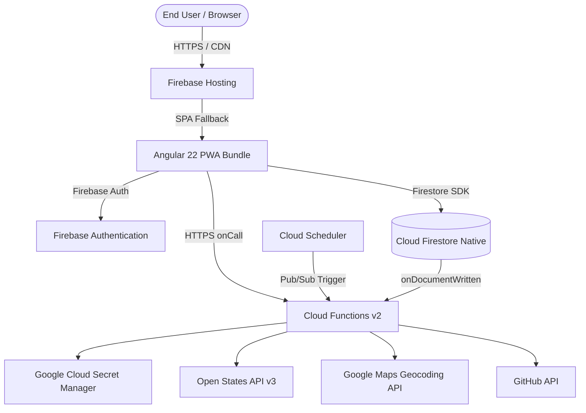

# Production Deployment Guide

This guide details how to build, configure, and deploy the **Legislative Tracker** platform to **Firebase** and **Google Cloud Platform (GCP)**.

## 1. Production Architecture Overview

The production deployment consists of:

- **Firebase Hosting**: Serves the Angular 22 Progressive Web Application (PWA) bundle (`dist/apps/client-angular/browser`) with automated SSL, global CDN caching, and SPA rewrite rules.
- **Firebase Cloud Functions (v2) on Cloud Run**: Scalable, containerized serverless functions handling HTTPS callables, background Firestore events, and scheduled cron jobs.
- **Cloud Firestore**: Managed NoSQL document database operating in Native Mode with custom security rules and composite indexes.
- **Google Cloud Secret Manager**: Secure storage for external API tokens and service keys.
- **Google Cloud Scheduler**: Automates daily legislation updates (`nightlyUpdate`) and monthly legislator refreshes (`monthlyUpdate`).



## 2. Prerequisites & GCP Provisioning

1. **Firebase CLI**:

   ```bash
   npm install -g firebase-tools
   firebase login
   ```

2. **Required GCP APIs**:
   Enable the following APIs on your Google Cloud Project:
   - Cloud Functions API (`cloudfunctions.googleapis.com`)
   - Cloud Run Admin API (`run.googleapis.com`)
   - Cloud Build API (`cloudbuild.googleapis.com`)
   - Secret Manager API (`secretmanager.googleapis.com`)
   - Cloud Scheduler API (`cloudscheduler.googleapis.com`)
   - Cloud Firestore API (`firestore.googleapis.com`)

3. **Service Account Permissions**:
   Ensure the Compute Engine / App Engine default service account (`<project-number>-compute@developer.gserviceaccount.com`) possesses:
   - `roles/secretmanager.secretAccessor` (to access API secrets)
   - `roles/datastore.user` (to query and mutate Firestore documents)

## 3. Configuring Secrets in Secret Manager

Cloud Functions v2 reads secrets at runtime via Google Cloud Secret Manager. Use the Firebase CLI to set production values:

```bash
# Open States API Key
firebase functions:secrets:set DATA_ACCESS_OPENSTATES --project <project-id>

# Google Maps Geocoding API Key
firebase functions:secrets:set DATA_ACCESS_GOOGLE_MAPS --project <project-id>

# GitHub Personal Access Token (for Issue creation)
firebase functions:secrets:set DATA_ACCESS_GITHUB --project <project-id>

# State Plugin Secrets (if applicable)
firebase functions:secrets:set PLUGIN_LEG_US_NY --project <project-id>
```

To grant function access to secrets:

```bash
firebase functions:secrets:grant DATA_ACCESS_OPENSTATES DATA_ACCESS_GOOGLE_MAPS DATA_ACCESS_GITHUB --project <project-id>
```

## 4. Production Application Configuration

Create a production configuration file for the client application in `apps/client-angular/public/assets/config.json`:

```json
{
  "production": true,
  "useEmulators": false,
  "firebase": {
    "projectId": "your-prod-project-id",
    "appId": "your-firebase-app-id",
    "databaseURL": "https://your-prod-project-id.firebaseio.com",
    "storageBucket": "your-prod-project-id.appspot.com",
    "apiKey": "your-prod-api-key",
    "authDomain": "your-prod-project-id.firebaseapp.com",
    "messagingSenderId": "your-sender-id",
    "measurementId": "G-YOURMEASUREMENTID",
    "projectNumber": "your-project-number",
    "version": "2"
  },
  "organization": {
    "name": "Civic Action Network",
    "url": "https://example.org"
  },
  "branding": {
    "primaryColor": "#673ab7",
    "logoUrl": "assets/logo.png",
    "faviconUrl": "favicon.ico",
    "darkMode": false
  }
}
```

## 5. Building & Deploying Manually

### 5.1 Build Monorepo Production Targets

```bash
# Build Angular Client PWA
npx nx build client-angular -c production

# Build Firebase Server Functions
npx nx build server-firebase -c production
```

Build outputs will be generated at:

- Client: `dist/apps/client-angular/browser`
- Server: `dist/apps/server-firebase`

### 5.2 Deploy Firestore Rules & Indexes

Deploy security rules and compound indexes before releasing new function triggers:

```bash
firebase deploy --only firestore:rules,firestore:indexes --project <project-id>
```

### 5.3 Deploy Full Project

Deploy all assets (Hosting, Functions, Firestore):

```bash
firebase deploy --project <project-id>
```

### 5.4 Partial Deployments

```bash
# Deploy frontend hosting only (fastest)
firebase deploy --only hosting --project <project-id>

# Deploy backend functions only
firebase deploy --only functions --project <project-id>

# Deploy a specific Cloud Function
firebase deploy --only functions:users-fetchUserReps --project <project-id>
```

## 6. Automated CI/CD Deployment (GitHub Actions)

The repository includes automated CI/CD deployment pipelines under [`.github/workflows/`](file:///home/jpstroud/projects/legislative-tracker/.github/workflows).

### Workflow Triggers

- **Pull Requests**: Runs linting, Vitest unit tests, Playwright E2E tests, and production build checks (`pipeline.yml`).
- **Push to `main`**: Runs versioning and release automation (`release.yml`).
- **Release Tags (`v*`)**: Automatically builds and deploys to Firebase Production (`deploy.yml`).

### Required GitHub Secrets & Variables

In your GitHub repository settings (**Settings > Secrets and variables > Actions**), configure:

| Secret Name                          | Description                                                              |
| :----------------------------------- | :----------------------------------------------------------------------- |
| `FIREBASE_SERVICE_ACCOUNT_TRACKER_*` | JSON Private Key for the Firebase Deployment Service Account             |
| `TRACKER_*_CONFIG`                   | Complete production `config.json` payload string to inject at build time |

## 7. Post-Deployment Verification & Initial Setup

1. **Verify PWA Installation**:
   Navigate to the production URL, verify SSL certificate, and check DevTools (**Application > Service Workers**) to confirm `ngsw-worker.js` is active.

2. **Initialize Supported State Jurisdictions**:
   In the Firestore database console, ensure the initial state legislature documents exist in the `legislatures` collection:
   - Document ID: `us-ny`, field `name: "New York"`
   - Document ID: `us-nj`, field `name: "New Jersey"`

3. **Trigger Initial Data Population**:
   Execute the manual update callables via an authenticated Admin user or the Firebase Functions console:
   - `legislation-manualUpdate`
   - `legislators-manualUpdate`

4. **Monitor Function Logs**:
   Stream live logs for errors or rate limits:
   ```bash
   firebase functions:log --project <project-id>
   ```
