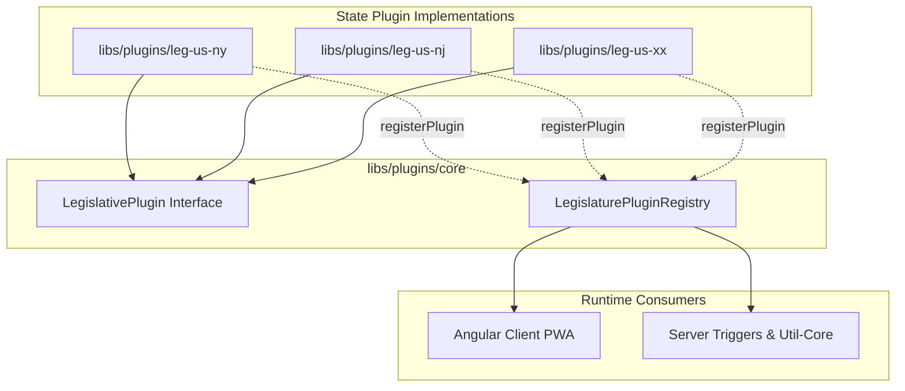

# State Plugin Authoring Guide

This guide details how to create, test, and register a new **State Legislature Plugin** for the **Legislative Tracker** platform.

The plugin system allows the platform to support any US state legislature by encapsulating jurisdiction-specific session calendars, chamber conventions, and data-retrieval mechanisms into isolated, testable packages.

## 1. Plugin Architecture Overview

All state plugins implement the `LegislativePlugin` contract exported by `@legislative-tracker/plugins-core`. Plugins are registered into the global `LegislaturePluginRegistry`, which is accessible in both the Angular client PWA and the Firebase Cloud Functions backend.



### Core Interfaces & Types

Defined in [`libs/plugins/core/src/lib/types.model.ts`](file:///home/jpstroud/projects/legislative-tracker/libs/plugins/core/src/lib/types.model.ts):

```typescript
export interface ChamberInfo {
  upper?: string; // e.g. 'Senate' (omitted for unicameral legislatures)
  lower?: string; // e.g. 'Assembly', 'House of Representatives', 'General Assembly'
}

export interface JurisdictionMetadata {
  id: string; // OCD Jurisdiction string (e.g. 'ocd-jurisdiction/country:us/state:ny/government')
  code: string; // Canonical code (e.g. 'us-ny')
  name: string; // Human-readable name (e.g. 'New York')
  isBicameral: boolean; // Whether the legislature has two chambers
  chambers: ChamberInfo; // Chamber naming mapping
  readonly currentSession: string; // Active session getter or static identifier
}

export interface PluginMetadata {
  id: string; // Unique plugin ID (e.g. 'leg-us-ny')
  name: string; // Plugin display name
  version: string; // Semantic version
  jurisdiction: JurisdictionMetadata;
  capabilities: {
    hasApi: boolean; // Indicates if direct state API integration is supported
    [key: string]: unknown;
  };
  description?: string;
}

export interface LegislativePlugin<TMember = unknown, TBill = unknown> {
  readonly metadata: PluginMetadata;
  calculateCurrentSession(date?: Date): string;
  initialize?(): Promise<void>;
  getMembers?(options?: GetMembersOptions): Promise<TMember[]>;
  getBills?(options?: GetBillsOptions): Promise<TBill[]>;
  syncJurisdiction?(options?: SyncOptions): Promise<SyncResult>;
}
```

## 2. Step-by-Step Implementation Guide

Follow these steps to add a new state plugin (e.g., Pennsylvania `us-pa`):

### Step 1: Create the Plugin Library Directory Structure

Under `libs/plugins/leg-us-pa/`, create the following files:

```
libs/plugins/leg-us-pa/
├── src/
│   ├── index.ts
│   └── lib/
│       ├── plugin-leg-us-pa.plugin.ts
│       └── plugin-leg-us-pa.plugin.spec.ts
├── package.json
├── project.json
├── tsconfig.json
├── tsconfig.lib.json
├── tsconfig.spec.json
└── vite.config.ts
```

#### `project.json` Example

```json
{
  "name": "plugins-leg-us-pa",
  "$schema": "../../../node_modules/nx/schemas/project-schema.json",
  "sourceRoot": "libs/plugins/leg-us-pa/src",
  "projectType": "library",
  "tags": ["scope:plugins", "type:plugin"],
  "targets": {
    "test": {
      "executor": "@nx/vitest:test",
      "outputs": ["{workspaceRoot}/coverage/libs/plugins/leg-us-pa"],
      "options": {
        "config": "libs/plugins/leg-us-pa/vite.config.ts"
      }
    }
  }
}
```

#### `package.json` Example

```json
{
  "name": "@legislative-tracker/plugins-leg-us-pa",
  "version": "1.0.0",
  "type": "module"
}
```

### Step 2: Implement the State Plugin Class

Create `libs/plugins/leg-us-pa/src/lib/plugin-leg-us-pa.plugin.ts`:

```typescript
import {
  LegislativePlugin,
  PluginMetadata,
  registerPlugin,
} from '@legislative-tracker/plugins-core';

export class LegUsPaPlugin implements LegislativePlugin {
  readonly metadata: PluginMetadata;

  constructor() {
    const self = this;
    this.metadata = {
      id: 'leg-us-pa',
      name: 'Pennsylvania General Assembly Plugin',
      version: '1.0.0',
      description:
        'Plugin for fetching and managing Pennsylvania State legislative data.',
      jurisdiction: {
        id: 'ocd-jurisdiction/country:us/state:pa/government',
        code: 'us-pa',
        name: 'Pennsylvania',
        isBicameral: true,
        chambers: {
          upper: 'Senate',
          lower: 'House of Representatives',
        },
        get currentSession(): string {
          return self.calculateCurrentSession();
        },
      },
      capabilities: {
        hasApi: false, // Set to true if direct state API integration is implemented
      },
    };
  }

  /**
   * Calculates the 2-year biennium session identifier for Pennsylvania.
   * Pennsylvania legislative sessions begin in odd-numbered years (e.g. 2025-2026).
   *
   * @param date Optional date to evaluate (defaults to current date)
   * @returns Session string in "YYYY-YYYY" format
   */
  calculateCurrentSession(date: Date = new Date()): string {
    const year = date.getFullYear();
    const startYear = year % 2 === 0 ? year - 1 : year;
    return `${startYear}-${startYear + 1}`;
  }
}

// Export singleton and auto-register
export const legUsPaPlugin = new LegUsPaPlugin();
registerPlugin(legUsPaPlugin).catch(() => {
  // Ignored if already registered
});
```

### Step 3: Export from `index.ts`

In `libs/plugins/leg-us-pa/src/index.ts`:

```typescript
export * from './lib/plugin-leg-us-pa.plugin';
```

### Step 4: Register Path Alias in `tsconfig.base.json`

Add the module mapping to `tsconfig.base.json`:

```json
{
  "compilerOptions": {
    "paths": {
      "@legislative-tracker/plugins-leg-us-pa": [
        "./libs/plugins/leg-us-pa/src/index.ts"
      ]
    }
  }
}
```

### Step 5: Register Plugin in Application Runtimes

1. **Angular Client PWA (`apps/client-angular/src/app.config.ts`)**:
   Import and register during application initialization:

   ```typescript
   import { legUsPaPlugin } from '@legislative-tracker/plugins-leg-us-pa';

   // Inside provideAppInitializer:
   LegislaturePluginRegistry.setEnabledPlugins(runtimeConfig.enabledPlugins);
   if (!LegislaturePluginRegistry.hasRegistered(legUsPaPlugin.metadata.id)) {
     LegislaturePluginRegistry.register(legUsPaPlugin);
   }
   ```

2. **Backend Server Resolver (`libs/server/util-core/src/lib/find-plugin-for-state.util.ts`)**:
   Import the plugin side-effect so it registers into the backend registry:
   ```typescript
   import '@legislative-tracker/plugins-leg-us-pa';
   ```

### Step 6: Configure Enabled State Plugins

You can configure which state plugins are active at deployment or runtime:

- **Client (`config.json` / `RuntimeConfig`)**:
  Specify `enabledPlugins` in `apps/client-angular/public/assets/config.json` or in Firestore `/configurations/global`:

  ```json
  {
    "enabledPlugins": ["us-ny", "us-pa"]
  }
  ```

  _(Accepts plugin IDs like `leg-us-ny`, jurisdiction codes like `us-ny`, or state abbreviations like `ny`. If omitted or empty, all installed plugins are enabled by default)._

- **Backend (`ENABLED_PLUGINS` Environment Variable)**:
  Set `ENABLED_PLUGINS` in your environment or Cloud Function parameters:
  ```bash
  ENABLED_PLUGINS=us-ny,us-pa
  ```

## 3. Session Calculation Strategies

Different US state legislatures calculate their sessions differently:

### 2-Year Biennium Starting in Odd Years (e.g., NY, PA, CA, TX)

```typescript
calculateCurrentSession(date: Date = new Date()): string {
  const year = date.getFullYear();
  const startYear = year % 2 === 0 ? year - 1 : year;
  return `${startYear}-${startYear + 1}`;
}
```

### 2-Year Biennium Starting in Even Years (e.g., NJ)

```typescript
calculateCurrentSession(date: Date = new Date()): string {
  const year = date.getFullYear();
  const startYear = year % 2 === 0 ? year : year - 1;
  return `${startYear}-${startYear + 1}`;
}
```

### Annual Sessions (e.g., AZ, ID)

```typescript
calculateCurrentSession(date: Date = new Date()): string {
  return `${date.getFullYear()}`;
}
```

### Unicameral Legislature (e.g., Nebraska)

For Nebraska, omit `upper` and set `isBicameral: false`:

```typescript
jurisdiction: {
  id: 'ocd-jurisdiction/country:us/state:ne/government',
  code: 'us-ne',
  name: 'Nebraska',
  isBicameral: false,
  chambers: {
    lower: 'Unicameral Legislature',
  },
  // ...
}
```

## 4. Writing Unit Tests

Create unit tests in `libs/plugins/leg-us-pa/src/lib/plugin-leg-us-pa.plugin.spec.ts`:

```typescript
import { describe, it, expect, beforeEach } from 'vitest';
import { LegislaturePluginRegistry } from '@legislative-tracker/plugins-core';
import { LegUsPaPlugin, legUsPaPlugin } from './plugin-leg-us-pa.plugin';

describe('LegUsPaPlugin', () => {
  let plugin: LegUsPaPlugin;

  beforeEach(() => {
    plugin = new LegUsPaPlugin();
  });

  it('should have valid metadata', () => {
    expect(plugin.metadata.id).toBe('leg-us-pa');
    expect(plugin.metadata.jurisdiction.code).toBe('us-pa');
    expect(plugin.metadata.jurisdiction.name).toBe('Pennsylvania');
    expect(plugin.metadata.jurisdiction.isBicameral).toBe(true);
    expect(plugin.metadata.jurisdiction.chambers.upper).toBe('Senate');
    expect(plugin.metadata.jurisdiction.chambers.lower).toBe(
      'House of Representatives',
    );
  });

  it('should calculate current session correctly across biennium boundaries', () => {
    expect(plugin.calculateCurrentSession(new Date(2025, 0, 15))).toBe(
      '2025-2026',
    );
    expect(plugin.calculateCurrentSession(new Date(2026, 11, 31))).toBe(
      '2025-2026',
    );
    expect(plugin.calculateCurrentSession(new Date(2027, 5, 1))).toBe(
      '2027-2028',
    );
  });

  it('should be registered in LegislaturePluginRegistry', () => {
    expect(LegislaturePluginRegistry.has('leg-us-pa')).toBe(true);
    expect(LegislaturePluginRegistry.get('leg-us-pa')).toBeDefined();
  });
});
```

Run tests with:

```bash
npx nx test plugins-leg-us-pa
```

## 5. Summary Checklist

- [ ] Created library under `libs/plugins/leg-us-<stateCd>`
- [ ] Implemented `LegislativePlugin` with proper OCD jurisdiction ID and canonical code
- [ ] Implemented correct `calculateCurrentSession` logic
- [ ] Added path mapping in `tsconfig.base.json`
- [ ] Registered in `apps/client-angular/src/app.config.ts`
- [ ] Registered in `libs/server/util-core/src/lib/find-plugin-for-state.util.ts`
- [ ] Added unit test suite covering session calculations and metadata
- [ ] Ran `npm test` and `npm run lint`
